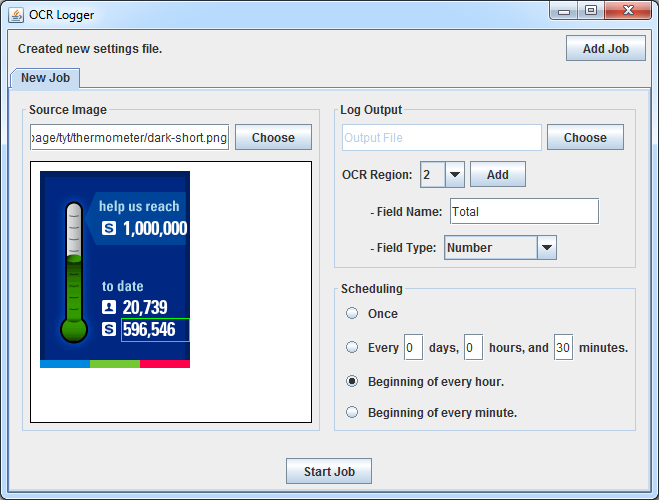

# OCRLogger
Web image scraper, for logging numbers to a CSV file using Tesseract OCR. A local client (with GUI) schedules downloads of an image and runs OCR on specified regions to log numbers or text.

### Local Client Screenshots

### Executable

A pre-built executable JAR is provided. From the repo, download only "OCRLogger.jar" and "tessdata.zip". Place the directory "tessdata" (unzipped) next to "OCRLogger.jar" for OCR to function. Usually you can just double-click the JAR. If not, you will need to research how to launch a JAR file.

This has been tested on Windows 7 64-bit only, with Java SE 1.8 64-bit installed.

### Manual Build Dependencies

- JavaSE-1.8 JDK + Wisdom to build Java source code
- Tesseract OCR via [Tess4J](https://github.com/nguyenq/tess4j) binding
